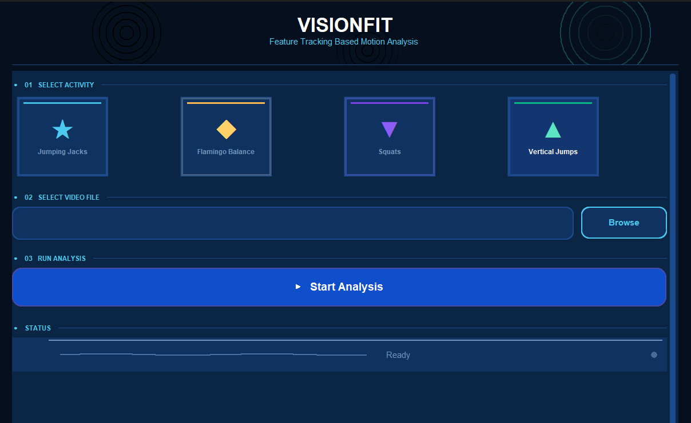
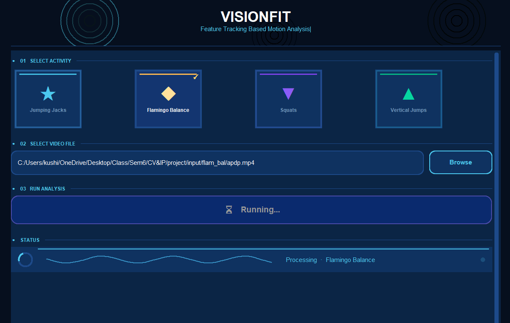
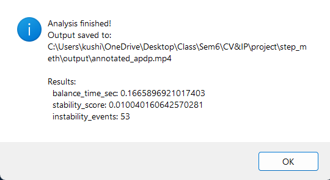

# VisionFit — Activity Analysis

> **22AIE313 · Computer Vision and Image Processing · Group A2**  
> Classical CV-based athletic activity assessment — no trained ML model required.

---

## Overview

VisionFit is a desktop application that analyses exercise videos using a **classical computer vision pipeline**. Given a video of a person performing a physical activity, it detects repetitions, measures performance metrics, and produces a fully annotated output video.

**Tech stack:** Python · OpenCV · NumPy · SciPy · CustomTkinter

---

## Screenshots









---

## Team & Contributions

| Member | Roll Number | Module |
|---|---|---|
| A P Devanampriya | CB.SC.U4AIE23001 | Flamingo Balance — `scripts/flam_bal.py` |
| K Prerana | CB.SC.U4AIE23038 | Vertical Jump — `scripts/vert_jumps.py` |
| Niharika Sharma | CB.SC.U4AIE23048 | Jumping Jack — `scripts/jump_jack.py` |
| Patel Srikari Shasi | CB.SC.U4AIE23053 | Squat Detection — `scripts/squats.py` |

> **Supervisor:** Dr. Sajith Variyar V.V  
> Desktop GUI (`ui/main_window.py`) and project integration developed by Niharika Sharma.

---

## Shared CV Pipeline

All four modules share the same base framework. Activity-specific logic branches at the FSM stage.

```
Input Video → MOG2 BG Subtraction → Morphology → Contour + Centroid
          → Shi-Tomasi Detection → Lucas-Kanade Optical Flow
          → Temporal Filter → Activity FSM → CSV + Annotated Video
```

| Stage | Method | Output |
|---|---|---|
| Background Subtraction | MOG2 Gaussian Mixture Model | Binary foreground mask |
| Morphological Cleanup | Open → Close → Dilate (5×5 ellipse) | Clean silhouette |
| Contour + Centroid | `cv2.findContours()`, area ≥ 2000 px² | Body contour & centroid |
| Feature Detection | Shi-Tomasi corners inside each ROI | ~80 keypoints per joint |
| Optical Flow | `cv2.calcOpticalFlowPyrLK()` | Tracked joint positions |
| Temporal Filtering | MA / EMA / Savitzky-Golay (per module) | Stable numeric signal |
| Activity FSM | Hysteresis thresholds + cooldown timer | Rep count + state label |
| Output | Per-frame overlay + CSV log | `annotated_*.mp4` + CSV |

---

## Activity Modules

### Squat Detection · `scripts/squats.py`
*Patel Srikari Shasi*

Counts squat repetitions by tracking the hip-to-ankle compression ratio.

- **4 manual ROIs:** Head, Hip, Palm, Ankle (L+R) — drawn on the first frame
- Feature tracking: Shi-Tomasi + LK (~80 corners per ROI), centroid averaged
- Signal: `D_t = Ankle_y − Hip_y`, normalized by baseline standing separation
- FSM: enters DOWN state when ratio > 0.15; counts +1 on return < 0.06
- Smoothing: 7-frame moving average; cooldown = 0.7 × fps
- Output: per-frame CSV with all joint coordinates, compression ratio, state, count

---

### Vertical Jump · `scripts/vert_jumps.py`
*K Prerana*

Measures jump height in centimetres using pixel-to-cm body calibration.

- **2 ROIs:** Head and Ankle (L+R)
- Body height proxy: `H_px = y_ankle − y_head` per frame; median used for calibration
- Pixel-to-cm ratio: `H_real / median(H_px)` — removes camera distance dependency
- Savitzky-Golay smoothing preserves peak height without distortion
- Peak detection: prominence ≥ 5, distance ≥ 5 frames
- Output: per-jump air-time, height (cm), mean/max summary across all jumps

---

### Flamingo Balance · `scripts/flam_bal.py`
*A P Devanampriya*

Scores single-leg balance via postural sway measured from the silhouette centroid.

- **No manual ROI** — uses MOG2 full-body segmentation directly
- Sway signal: Euclidean shift between consecutive centroids
- EMA smoothing (α = 0.8) for stable output
- Stability states: STABLE (< 12 px) · BORDERLINE (12–25 px) · INSTABILITY (≥ 25 px)
- Balance score: stable frames / total frames ∈ [0, 1]
- Area change > 40% triggers instability flag independently of centroid

---

### Jumping Jacks · `scripts/jump_jack.py`
*Niharika Sharma*

Counts repetitions using a composite arm+leg spread signal.

- Tracks wrist (L+R) and ankle (L+R) via silhouette-based feature tracking
- Signal: `S(t) = (D_arms + D_legs) / 2`, normalized by head-to-ankle body span
- One rep = one CLOSED → OPEN → CLOSED cycle
- Asymmetric FSM thresholds prevent boundary oscillation
- Body-height normalization makes thresholds valid across subjects and camera distances

---

## Setup & Usage

### Install dependencies

```bash
pip install opencv-python numpy scipy customtkinter pillow
```

### Run

```bash
cd step_meth
python main.py
```

### Workflow

1. Click an **activity card** to select the exercise type
2. Click **Browse** and select a `.mp4 / .avi / .mov` video file
3. Click **▶ Start Analysis**
4. For **Squats** and **Vertical Jumps** — draw the ROI boxes on the first frame when prompted, then press `SPACE` or `ENTER` to confirm each one in order:
   - Squats: Head → Hip → Palm → Ankle
   - Vertical Jump: Head → Ankle
5. The annotated video is saved to `output/` and opened automatically when done

> **ROI tip:** ROI selections are cached as JSON in `output/rois/` and reused automatically on subsequent runs with the same video.

---

## Project Structure

```
step_meth/
├── main.py                 # Entry point — launches the UI
├── README.md               # This file
├── ui/
│   └── main_window.py      # CustomTkinter animated desktop UI
├── scripts/
│   ├── squats.py           # Squat detection module
│   ├── vert_jumps.py       # Vertical jump measurement module
│   ├── flam_bal.py         # Flamingo balance scoring module
│   └── jump_jack.py        # Jumping jack counting module
├── input/
│   └── ...                 # Source video files
└── output/
    ├── annotated_*.mp4     # Processed output videos
    └── rois/
        └── *.json          # Cached ROI selections per video
```

> Each script exposes a single `run_analysis(video_path, output_path) → dict` function called by the UI via `importlib`. No script internals change when swapping the frontend.

---

## Known Limitations

| Issue | Module | Cause | Mitigation |
|---|---|---|---|
| MOG2 absorbs stationary body | Flamingo, Squat | BG model adapts over ~30s | Lower learning rate for sustained postures |
| Marker tracking drift | Squat, Jump | LK diverges under occlusion | Feature re-init every N frames |
| Centroid jumps | Flamingo | Second person enters frame | Reject contours far from prior centroid |
| Wrist/ankle detection loss | Jumping Jack | Limbs exit frame boundary | Confidence threshold + interpolation |
| Jump calibration error | Vertical Jump | Head tracking drift | Body height consistency check σ/H_med |
